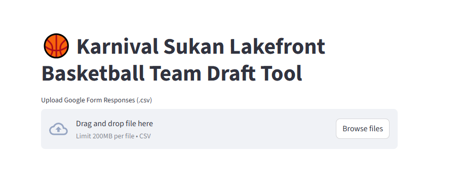
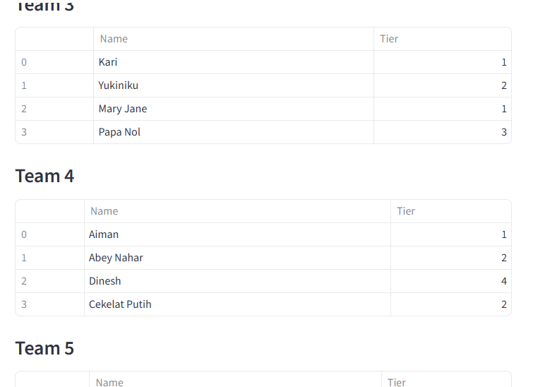

# 🏀 Basketball Draft App – Karnival Sukan Lakefront Edition

This is a Python + Streamlit web app created to **automate fair and balanced team drafting** for our annual **Karnival Sukan Lakefront Cyberjaya** basketball tournament (4v4 half-court format).

I started learning Python less than a month ago and decided to turn this local event into a real-world coding project (with a lot of help from ChatGPT 😄).

---

## 🔧 What It Does

- ✅ Upload player data from a **Google Form (CSV)**
- 🧠 Automatically assigns **skill tiers (1–4)** based on questionnaire scoring
- ⚖️ Drafts **balanced teams** using skill tier totals
- 🎲 Supports **re-drafting** or **resetting**
- 📤 Export or copy team results
- 📱 Clean, mobile-friendly UI (Streamlit)

---

## 📂 How To Use

1. Fill out or collect responses using a Google Form (see `sample Google Form.pdf`)
2. Download the responses as a `.csv` file
3. Upload it into the app
4. Set number of teams
5. Click **Draft Teams**

You can also re-draft or reset at any time.

---

## 🧪 Sample Data

A sample Google Form CSV with 20 dummy players is included (`dummy_google_form_responses.csv`) to help you test the app.

---

## 🚀 Built With

- [Python](https://www.python.org/)
- [Streamlit](https://streamlit.io/)
- 💡 Prompt engineering with ChatGPT

---

## 📸 Screenshot

---

## 📌 Why I Made This

I love basketball, and this sports carnival has become a tradition in my community.  
I wanted to give back a little - and also build my first real,real portfolio project using Python.

---

## 📬 Contact

Feel free to reach out via [LinkedIn](https://www.linkedin.com/in/danial-jaafar-909/) or contribute if you'd like at my [Github!](https://github.com/mohdjm/basketball_team_draft)

---

## 🧠 Shoutout

Special thanks to ChatGPT, this would’ve been 10x harder without it.

